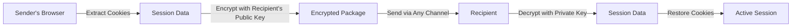

<div align="center">


# SecureShare

### 🔐 Share Your Accounts Without Sharing Your Passwords

  [](https://github.com/mrx-arafat/SecureShare/releases)
  [](https://github.com/mrx-arafat/SecureShare/blob/main/manifest.json)
  [](https://github.com/mrx-arafat/SecureShare/blob/main/LICENSE)
  [](https://www.google.com/chrome/)
  [](https://github.com/mrx-arafat/SecureShare/stargazers)
  [](https://github.com/mrx-arafat/SecureShare/issues)

  **A Chrome extension that enables secure, temporary account sharing without revealing passwords**

  [**Install Extension**](#-installation) • [**Quick Start**](#-quick-start) • [**How It Works**](#-how-it-works) • [**Security**](#-security)

</div>

---

## 🎯 Overview

SecureShare is a revolutionary Chrome extension that solves a common problem: sharing access to online accounts without compromising security. Using military-grade encryption, it allows you to share your logged-in sessions temporarily without ever revealing your passwords.

### ✨ Key Features

- 🔒 **Zero Password Exposure** - Share accounts without revealing credentials
- ⏱️ **Time-Limited Access** - Set automatic expiration for shared sessions
- 🔐 **End-to-End Encryption** - Military-grade EC-ElGamal cryptography
- 📱 **Universal Compatibility** - Works with any website or web application
- 🚀 **One-Click Sharing** - Simple, intuitive interface
- 📊 **Share History** - Track and manage all your shared sessions
- 🛡️ **Privacy-First** - No external servers, no data collection
- 🔄 **Instant Revocation** - Cancel access anytime

### 💡 Use Cases

- **👨‍👩‍👧‍👦 Family Sharing** - Share streaming services with family members
- **👥 Team Collaboration** - Provide temporary access to work accounts
- **🆘 Remote Support** - Help others access their accounts securely
- **📱 Device Switching** - Transfer sessions between your devices
- **🎮 Gaming Accounts** - Share game accounts without password risks

---

## 📦 Installation

### Option 1: Chrome Web Store (Recommended)

*Coming soon - Currently in review*

### Option 2: Manual Installation

1. **Download the Extension**

   ```bash
   git clone https://github.com/mrx-arafat/SecureShare.git
   cd SecureShare
   ```
2. **Open Chrome Extensions Page**

   - Navigate to `chrome://extensions/`
   - Or go to Menu → More Tools → Extensions
3. **Enable Developer Mode**

   - Toggle the "Developer mode" switch in the top-right corner
4. **Load the Extension**

   - Click "Load unpacked"
   - Select the `SecureShare` folder
   - The SecureShare icon will appear in your toolbar

---

## 🚀 Quick Start

### Sharing an Account (Sender)

<table>
<tr>
<td width="50%">

### Receiving an Account (Recipient)

1. **Open SecureShare** → Click "Receive Account"
2. **Share Your Code** → Send your unique code to the sender
3. **Paste Encrypted Data** → Paste what you received from sender
4. **Click Receive** → Website opens with active session!

---

## 🔧 How It Works

### Technical Architecture



### Encryption Process

1. **🔑 Key Generation**

   - Each installation generates a unique EC-ElGamal key pair
   - Public key for encryption, private key for decryption
   - Keys stored locally in browser storage
2. **📦 Session Packaging**

   - Current tab's cookies are extracted
   - Session data includes URL and expiration time
   - Data is serialized into a secure format
3. **🔐 Encryption**

   - Data encrypted using recipient's public key
   - Only recipient's private key can decrypt
   - Uses Stanford Javascript Crypto Library (SJCL)
4. **📤 Transfer**

   - Encrypted data converted to shareable text
   - Can be sent through any communication channel
   - No data passes through external servers
5. **🔓 Restoration**

   - Recipient decrypts with their private key
   - Cookies are restored to browser
   - Website session becomes immediately active

---

## 🔒 Security

### Encryption Standards

| Component | Technology                         | Security Level    |
| --------- | ---------------------------------- | ----------------- |
| Algorithm | EC-ElGamal (Elliptic Curve)        | Military-grade    |
| Library   | Stanford Javascript Crypto Library | Industry Standard |
| Key Size  | 256-bit elliptic curve             | High Security     |
| Storage   | Local browser storage only         | Privacy-focused   |

### Security Features

✅ **No Password Storage** - Passwords never leave your device
✅ **No External Servers** - All processing happens locally
✅ **Automatic Expiration** - Sessions expire at set times
✅ **One-Way Encryption** - Only recipient can decrypt
✅ **Key Regeneration** - Generate new keys anytime
✅ **No Tracking** - Zero analytics or data collection

### Best Practices

- 🔐 Only share with trusted individuals
- ⏰ Use short expiration times when possible
- 🔄 Regenerate keys periodically
- 📋 Review share history regularly
- 🚫 Revoke access if suspicious activity detected

---

## 🛠️ Development

### Prerequisites

- Node.js 14+ and npm
- Chrome Browser
- Git

### Setup

```bash
# Clone repository
git clone https://github.com/mrx-arafat/SecureShare.git
cd SecureShare

# Install dependencies
npm install

# Build for production
npm run build:prod

# Package extension
npm run package
```

### Project Structure

```
SecureShare/
├── manifest.json          # Extension configuration
├── icons/                 # Extension icons
│   ├── 16.png
│   ├── 18.png
│   ├── 19.png
│   ├── 38.png
│   ├── 48.png
│   └── 128.png
├── popup/                 # Extension popup
│   ├── index.html        # Popup UI
│   ├── css/              # Styles
│   ├── js/               # Scripts
│   └── images/           # Assets
├── gulpfile.js           # Build configuration
├── package.json          # Dependencies
├── CHANGELOG.md          # Version history
├── CONTRIBUTING.md       # Contribution guidelines
├── LICENSE              # MIT License
├── PRIVACY.md           # Privacy policy
└── README.md            # Documentation
```

---

## 📝 Changelog

### Version 1.0.0 (2024)

- 🎉 Initial release
- ✅ Core sharing functionality
- ✅ EC-ElGamal encryption
- ✅ Time-limited sessions
- ✅ Share history tracking
- ✅ Manifest V3 support
- ✅ Transparent icon design

---

## 🤝 Contributing

Contributions are welcome! Please see our [Contributing Guidelines](https://github.com/mrx-arafat/SecureShare/blob/main/CONTRIBUTING.md) for details.

1. Fork the repository on [GitHub](https://github.com/mrx-arafat/SecureShare/fork)
2. Create your feature branch (`git checkout -b feature/AmazingFeature`)
3. Commit your changes (`git commit -m 'Add AmazingFeature'`)
4. Push to the branch (`git push origin feature/AmazingFeature`)
5. Open a [Pull Request](https://github.com/mrx-arafat/SecureShare/pulls)

---

## 📄 License

This project is licensed under the MIT License - see the [LICENSE](https://github.com/mrx-arafat/SecureShare/blob/main/LICENSE) file for details.

---

## 👨‍💻 Author

**Easin Arafat**
- GitHub: [@mrx-arafat](https://github.com/mrx-arafat)
- Email: [arafatmrx@gmail.com](mailto:arafatmrx@gmail.com)
- Website: [profile.arafatops.com](https://profile.arafatops.com)

---

## 🙏 Acknowledgments

- [Stanford Javascript Crypto Library](https://github.com/bitwiseshiftleft/sjcl) for encryption
- [Chrome Extensions Documentation](https://developer.chrome.com/docs/extensions/)
- [Balloon.css](https://kazzkiq.github.io/balloon.css/) for tooltips
- All contributors and users of SecureShare

---

## ⭐ Support

If you find SecureShare useful, please consider:

- ⭐ [Star this repository](https://github.com/mrx-arafat/SecureShare/stargazers)
- 🐛 [Report bugs and issues](https://github.com/mrx-arafat/SecureShare/issues/new)
- 💡 [Suggest new features](https://github.com/mrx-arafat/SecureShare/issues/new)
- 🍴 [Fork the project](https://github.com/mrx-arafat/SecureShare/fork)
- 📢 Share with others who might benefit

---

<div align="center">

  **SecureShare - Because Security Shouldn't Compromise Convenience**

  Made by [Easin Arafat](https://github.com/mrx-arafat)

</div>
